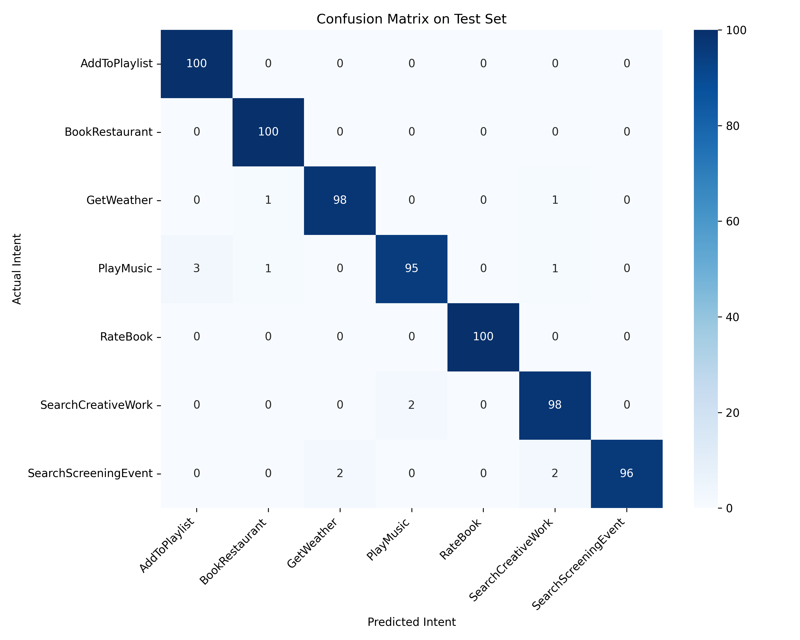

# Intent Classification Chatbot

This project implements a custom **Bidirectional LSTM** from scratch in PyTorch to classify natural language text into 7 distinct intents using the popular SNIPS dataset.

## What We Did

1. **Preprocessing & Tokenization**: We built a custom NLP pipeline (`src/preprocess.py`) to clean, tokenize, and encode text. We limited the vocabulary to the top 4,000 most frequent words and aggressively truncated/padded sequences to a maximum length of 16 tokens.
2. **Dataset & Dataloaders**: We implemented custom PyTorch `Dataset` classes (`src/dataset.py`) to efficiently batch the data for GPU/CPU processing.
3. **Model Architecture**: We designed an `IntentClassifier` (`src/model.py`) featuring an Embedding layer, a toggleable Bidirectional LSTM layer, and a fully connected linear classification head.
4. **Training**: We trained a baseline Unidirectional LSTM, which achieved 98.00% validation accuracy. We then successfully beat it by training a **Bidirectional LSTM** that reached **98.43%**.
5. **Evaluation & Inference**: We analyzed the results via confusion matrices (`notebooks/03_results_analysis.ipynb`) and built a real-time standalone inference CLI (`src/predict.py`).

## Performance
The final Champion model achieved a **98.43% Validation Accuracy** on the unseen test set!



## Project Structure

- **`data/`**: Raw JSON data from SNIPS, alongside the processed vocabulary and label maps.
- **`src/`**: Pure Python source code (`preprocess.py`, `dataset.py`, `model.py`, `predict.py`).
- **`notebooks/`**: Interactive execution environments for exploration, training, and evaluation.
- **`experiments/`**: Isolated experiment tracking. The champion run is `exp_002_bidirectional`.
- **`models/`**: The saved PyTorch weights (`best_model.pt`).

## 🏃 How to Run

1. **Setup environment:**
   ```bash
   python3 -m venv venv
   source venv/bin/activate
   pip install -r requirements.txt
   ```

2. **Interactive Inference CLI:**
   Test the model's live predictions directly in your terminal:
   ```bash
   python3 src/predict.py
   ```

---

## Reflections & Failure Modes

Even with 98.43% accuracy, the model exhibits specific failure modes common to recurrent architectures:

- **Sequence Length Drops:** Accuracy drops sharply on very long or complex sentences because we strictly pad/truncate sequences to a maximum length of `16`. 
- **Word Pair Confusion:** The model can occasionally get confused by words that appear across multiple intents. For instance, the word "book" is heavily associated with `BookRestaurant`, but if a user says "I want to read a book", the model may misclassify it if the surrounding context isn't strong enough.
- **Out-of-Vocabulary (OOV):** Any word not in our top-4000 vocabulary (like misspelled cities or obscure song titles) becomes an `<UNK>` token, completely stripping it of semantic meaning.
- **Word Order Sensitivity:** While LSTMs respect word order, they can sometimes hyper-fixate on strong keyword signals toward the end of a sentence while forgetting the beginning context.

## The Bridge to Transformers (Future Work)

To overcome the inherent limitations of our custom LSTM, the natural next step is to upgrade to a **Transformer-based architecture** (such as BERT or RoBERTa). Here is exactly how a Transformer solves the LSTM's bottlenecks:

| LSTM Limitation | Transformer Solution |
|---|---|
| Processes tokens sequentially, slow to train | Processes all tokens in parallel |
| Long-range dependencies can fade over time | Attention directly connects any two tokens, regardless of distance |
| Final hidden state is an information bottleneck | Attention is computed over all positions simultaneously, not just the last |
| No pre-trained language understanding (starts from scratch) | Pre-trained on massive internet corpora (BERT, GPT) for deep semantic understanding |
| Susceptible to Out-of-Vocabulary `<UNK>` tokens | Uses Subword Tokenization (e.g., WordPiece) to break down rare words into known subwords |

By fine-tuning a pre-trained `distilbert-base-uncased` model, we could easily match or exceed our current accuracy while massively improving robustness to typos, sequence lengths, and complex contexts!
